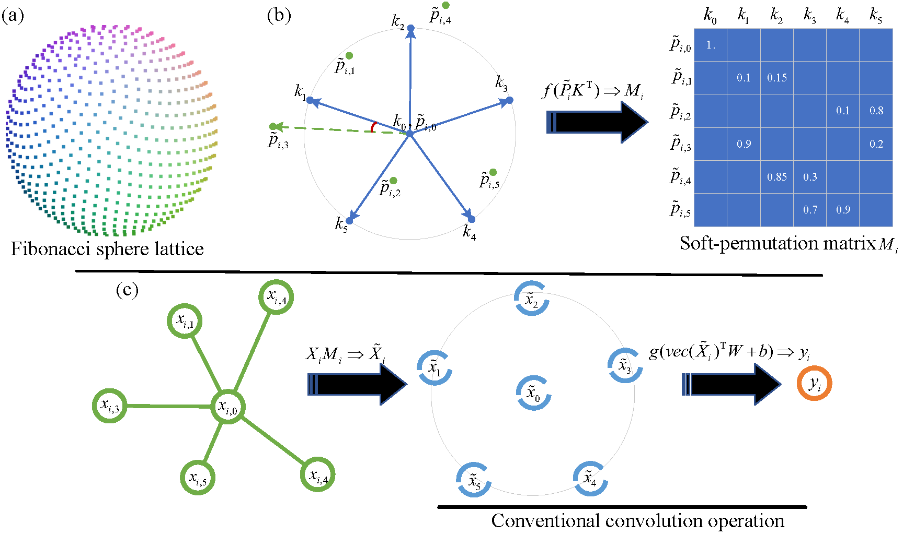

# PAI-Conv: Permutable Anisotropic Convolutional Networks for Learning on Point Clouds [Segmentation]

This is the official implementation of **PAI-Conv** for point cloud semantic segmentation:
 
<p align="center">  </p>


	
### (1) Setup
This code has been tested with Python 3.7, Tensorflow 2, CUDA 12.0 on Ubuntu 18.04.
 
- Clone the repository 
```
git clone https://github.com/Gaozhongpai/PaiConvPointSeg && cd PaiConvPointSeg
```
- Setup python environment
```
conda create -n paiconv python=3.7
source activate paiconv
pip install -r helper_requirements.txt
sh compile_op.sh
```

### (2) S3DIS
S3DIS dataset can be found 
<a href="https://docs.google.com/forms/d/e/1FAIpQLScDimvNMCGhy_rmBA2gHfDu3naktRm6A8BPwAWWDv-Uhm6Shw/viewform?c=0&w=1">here</a>. 
Download the files named "Stanford3dDataset_v1.2_Aligned_Version.zip". Uncompress the folder and move it to 
`/data/S3DIS`.

- Preparing the dataset:
```
python utils/data_prepare_s3dis.py
```
- Start 6-fold cross validation:
```
sh jobs_6_fold_cv_s3dis.sh
```
- Move all the generated results (*.ply) in `/test` folder to `/data/S3DIS/results`, calculate the final mean IoU results:
```
python utils/6_fold_cv.py
```

### (3) Semantic3D
7zip is required to uncompress the raw data in this dataset, to install p7zip:
```
sudo apt-get install p7zip-full
```
- Download and extract the dataset. First, please specify the path of the dataset by changing the `BASE_DIR` in "download_semantic3d.sh"    
```
sh utils/download_semantic3d.sh
```
- Preparing the dataset:
```
python utils/data_prepare_semantic3d.py
```
- Start training:
```
python main_Semantic3D.py --mode train --gpu 0
```
- Evaluation:
```
python main_Semantic3D.py --mode test --gpu 0
```


**Note:** 
- Preferably with more than 64G RAM to process this dataset due to the large volume of point cloud


### (4) SemanticKITTI

SemanticKITTI dataset can be found <a href="http://semantic-kitti.org/dataset.html#download">here</a>. Download the files
 related to semantic segmentation and extract everything into the same folder. Uncompress the folder and move it to 
`/data/semantic_kitti/dataset`.
 
- Preparing the dataset:
```
python utils/data_prepare_semantickitti.py
```

- Start training:
```
python main_SemanticKITTI.py --mode train --gpu 0
```

- Evaluation:
```
sh jobs_test_semantickitti.sh
```


### Acknowledgment
The structure of this codebase is borrowed from [RandLA-Net](https://github.com/QingyongHu/RandLA-Net).

### License
Licensed under the CC BY-NC-SA 4.0 license, see [LICENSE](./LICENSE).